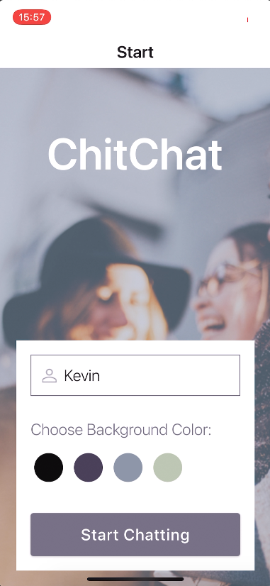
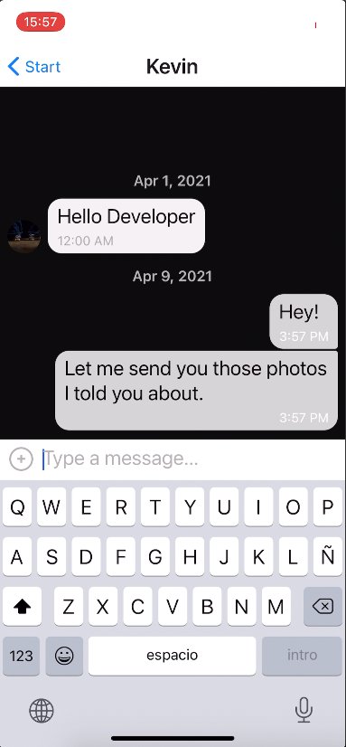
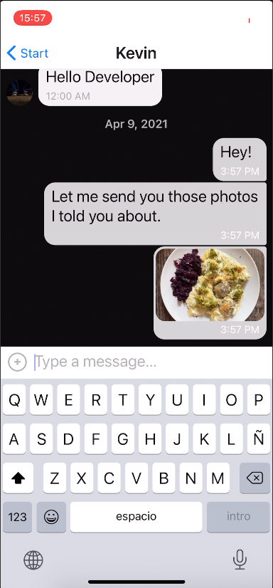
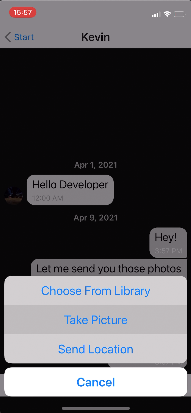
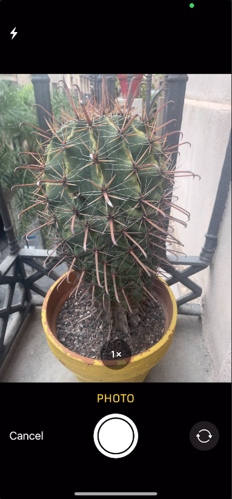
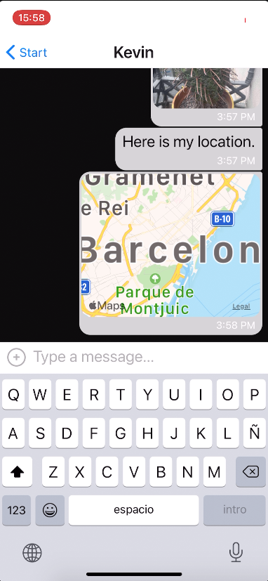

# ChitChat
Made with **React Native**.
### Description
**ChitChat** is a messenger service application  similar to WhatsApp, where users can do the following:

* send and receive text messages
* send and receive images, or photos
* take photos with the mobile phone´s camera, and send them as a message
* share the user´s location
* view messages, images, photos, and location offline

# Take a Look at the App

# Running the application

1. Install the Expo CLI on your machine:
`npm install expo-cli g`

2. Clone the application: 
`git clone https://github.com/kevmhughes/ChitChat`

2. Enter the root folder: 
`cd ChitChat`

4. Install dependencies in the root folder:

5. Open the project in the root folder:
 `expo start`

# Tools Used

### Frameworks
* React Native
* Expo CLI

### Development Environment
* Node.js
* Android Studio
* Expo Go

### Libraries
* Gifted Chat

### Database & Storage
* Google Firebase

Database configuration (which one, where to put database credentials, etc.)

### Dependencies

    "@react-native-community/async-storage": "~1.12.0",
    "@react-native-community/masked-view": "^0.1.10",
    "@react-native-community/netinfo": "^5.9.7",
    "@react-navigation/native": "^5.9.3",
    "@react-navigation/stack": "^5.14.3",
    "expo": "~40.0.0",
    "expo-image-picker": "^9.2.0",
    "expo-location": "^10.0.0",
    "expo-permissions": "^10.0.0",
    "expo-status-bar": "~1.0.3",
    "firebase": "^7.9.0",
    "npm": "^7.8.0",
    "prop-types": "^15.7.2",
    "react": "16.13.1",
    "react-dom": "16.13.1",
    "react-native": "https://github.com/expo/react-native/archive/sdk-40.0.1.tar.gz",
    "react-native-gesture-handler": "~1.8.0",
    "react-native-gifted-chat": "^0.16.3",
    "react-native-maps": "0.27.1",
    "react-native-paper": "^4.7.2",
    "react-native-reanimated": "~1.13.0",
    "react-native-safe-area-context": "^3.1.9",
    "react-native-screens": "~2.15.2",
    "react-native-svg": "^12.1.0",
    "react-native-svg-transformer": "^0.14.3",
    "react-native-web": "~0.13.12",
    "react-navigation": "^4.4.4",
    "react-navigation-stack": "^2.10.4"

## 1.Expo
Install the Expo CLI on your machine:
`npm install expo-cli g`
https://docs.expo.io
**Project dependencies**

TRELLO board
